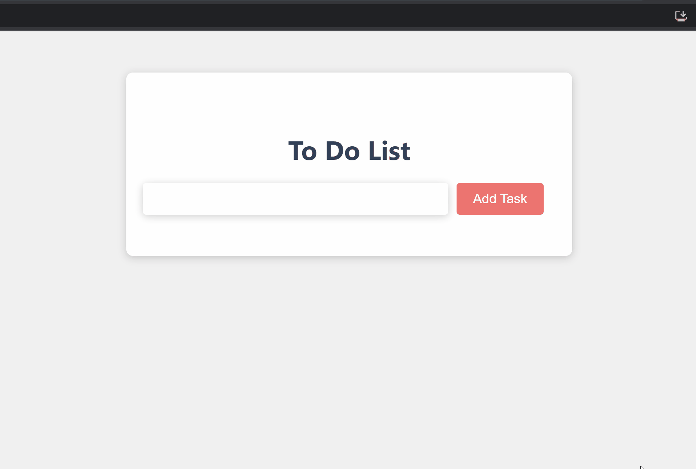

# Hackathon #4 - To-Do List App

###### April 2023

A React app that keeps track of your to-do's

## Screenshots

## Motivation

This week's hackathon task was to create a to-do list app using React. Being new to React, we did struggle to understand states and props. We created a component tree to help us understand the flow of data better and where to place states and pass down props. We also created a plan on how to approach the task. We were able to create the majority of the functionality but were not able to complete it in the given time.

This app is my re-creation of that task, from scratch, the following day on my own.

## Lessons Learned

Having only done an hour or two's worth of coding using React, this project was really useful to cement those ideas and build understanding.

Main lessons learned:

- A component tree is an incredibly useful tool to give you the big picture of what you are building. I include states and props on the diagram to understand the data flow.
- How to get a user's input and then display it using React
- To always make sure I put the square brackets in the state function that updates the array when using the spread operator.

## Tech Stack

**Client:** React, JavaScript, HTML, CSS

## Installation and Setup Instructions

You will need `node` and `npm` installed on your machine.

Clone the repo:

`https://github.com/anjiqbal/todo-list-app.git`

Install the required npm modules:

`npm install`

Start the application:

`npm start`

## Improvements

Potential future improvements:

- Add a way of ordering tasks based on priority
- Add a checkbox that a user can click and add a strike-through effect to the item in the list
- Add an option to pick a due date

## Usage

1. Add items to the list by typing them in the input and then pressing the ADD TASK button or by pressing enter on your keyboard.

2. Delete items by clicking the X button to the right of each task
